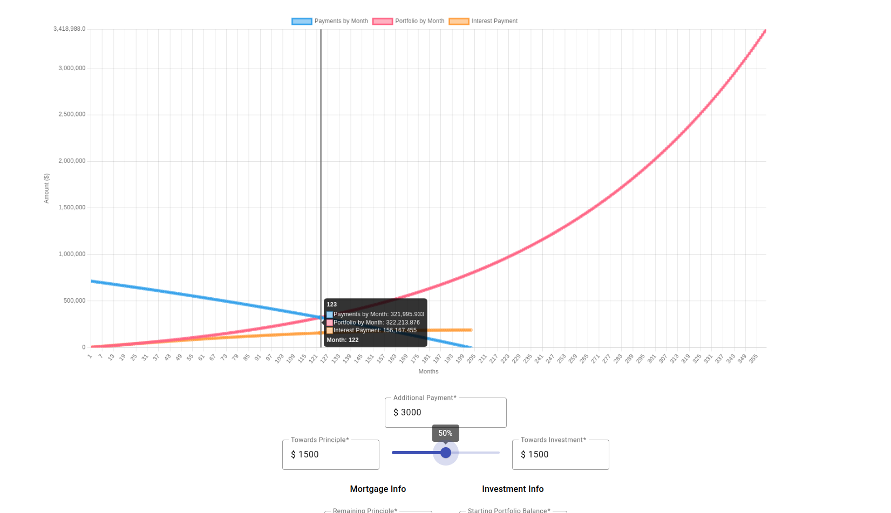

# InvestOMortgage

## Overview
You have a fixed rate 30 year mortgage, but you are able to save up some extra money from your income. Should you put that money towards making additional payments towards your mortgage principle? Or should you invest it in assets in hopes that your return on investment (ROI) on the asset(s) will exceed that of the interest rate and will be high enough so that you can pay-off the loan sooner in lumpsum?

The answer largely depends on what your goal is. But typically the goal is to pay as little interest as possible. Both options -- additional principle payments and investing in assets -- will result in the ability to pay of the loan sooner. The question is which one will allow you to pay lesser interest? Use this tool to make that determination.

**Notes**:
* The tools assumes a fixed interest rate.
* If your assets grow with a huge variance, use the average.
* All estimates are based on the fact that the payments are going to ne of consistent amount paid monthly. If you suspect increasing the payments overtime, guess the best average over the years till you're able to pay of the loan.

### Other Use-Cases
The chart lines can be hidden, so you can use this chart for simpler purposes like finding out how much your retirement fund (401(k), Roth IRA, etc.) will be worth at the time of maturiy.
1. Investment growth estimates, compounded overtime.
2. Total interest paid over a period.
3. Amortization schedule.

## Directions

The tool is primarily chart based. Which means that you will need to use the tool to figure out whether it makes sense for you to put your additional savings down towards an investment account or mortgage payments (principle).

* Input the respective values for all inputs.
  * Use the slider (or manual inputs) to dictate how much portion of your additional payment will go towards mortgage payments (towards principle) and investment contributions.
* Once the values are charted you are ready to compare.
* The point of intersection between the investment portfolio value and your outstanding balance will be the point where you will be able to completely pay off your remaining mortgage principle with you entire portfolio value.
* The corresponding point on the total interest line will be how much interest you would have paid by that point in time.
* The floating tooltip should display all this necessary information to help you compare different decisions.
